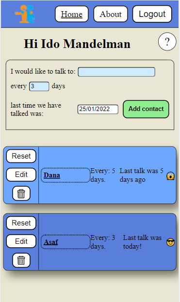

# Staying in touch - Contact Web-app

## Description
Contact app created to remind you to stay in touch with the people in your life.
Created using Next.js, styling-component and firebase 

## Usage

For live demo: https://stay-in-touch.vercel.app/

from this point you are free to add your own contact.


### to run on your own computer

After cloning the repo, 

open the terminal and run
```bash
yarn add
```

after that, opening the code in your browser of choice will result in this image:




## License
[MIT](https://choosealicense.com/licenses/mit/)

