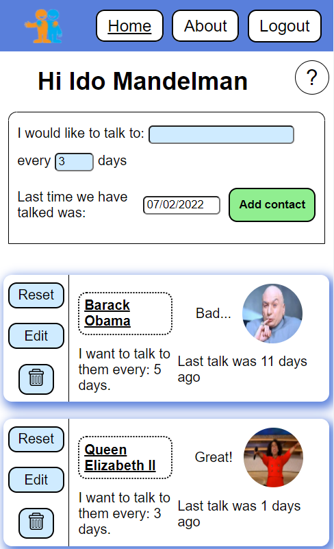

# Stay-in-Touch
For the live App: https://stay-in-touch.vercel.app/

## Description

Stay in touch with your friends and family with the Contact App.

The project is available as a **PWA (Progressive Web App)**, which can be downloaded and used offline on any android, PC, or Mac device. 

This app was built using the **Next.JS** framework and converted into **TypeScript** to improve maintainability.
**Firebase** Cloud Platform is responsible for maintaining the backend and database.
The CSS-in-js library **Styled-Components** was used to create the Design System.

## License

[MIT](https://choosealicense.com/licenses/mit/)
